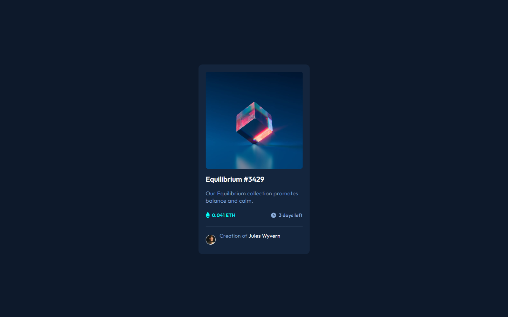
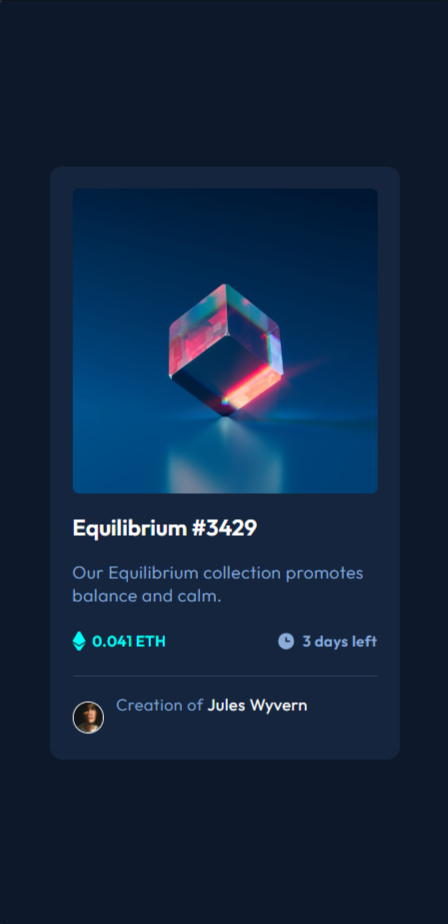

# Frontend Mentor - NFT preview card component solution

This is a solution to the [NFT preview card component challenge on Frontend Mentor](https://www.frontendmentor.io/challenges/nft-preview-card-component-SbdUL_w0U). Frontend Mentor challenges help you improve your coding skills by building realistic projects. 

## Table of contents

- [Overview](#overview)
  - [The challenge](#the-challenge)
  - [Screenshot](#screenshot)
  - [Links](#links)
- [My process](#my-process)
  - [Built with](#built-with)
  - [What I learned](#what-i-learned)
  - [Continued development](#continued-development)
  - [Useful resources](#useful-resources)
- [Author](#author)
- [Acknowledgments](#acknowledgments)

**Note: Delete this note and update the table of contents based on what sections you keep.**

## Overview

### The challenge

Users should be able to:

- View the optimal layout
- See hover states for interactive elements

### Screenshot

#### Desktop
<a href="#" target="_blank">
  
</a>

#### Mobile
<a href="#" target="_blank">
  
</a>

### Links

- Solution URL: [Solution URL - Repository](https://github.com/julialimp/nft-card-component)
- Live Site URL: [Live site - GitHub Pages](https://julialimp.github.io/nft-card-component/)

## My process

### Built with

- Semantic HTML5 markup
- CSS custom properties
- Flexbox

### What I learned

I was able to practice some more of Flexbox properties, styling and using CSS variables to set default colors.


```css
:root {
    --primary-soft: hsl(215, 51%, 70%);
    --primary-medium: hsl(178, 100%, 50%);
    --neutral-dark: hsl(217, 54%, 11%);
    --neutral-medium: hsl(216, 50%, 16%);
    --neutral-soft: hsl(215, 32%, 27%);
}

body {
    background-color: var(--neutral-dark);
    font-family: 'Outfit', sans-serif;
}
```
## Author

- Linkedin - [Juia Limp](https://www.linkedin.com/in/julialimp)
- Instagram - [@julialimp](https://www.instagram.com/julialimp)
- GitHub - [@julialimp](https://github.com/julialimp)